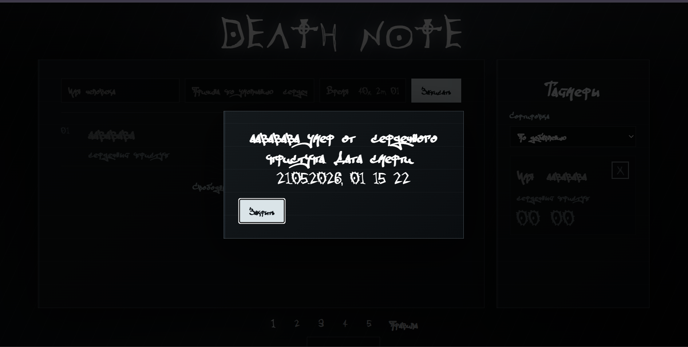
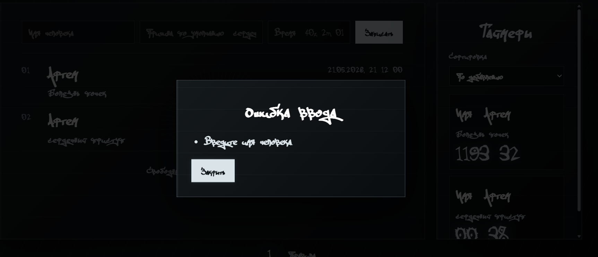
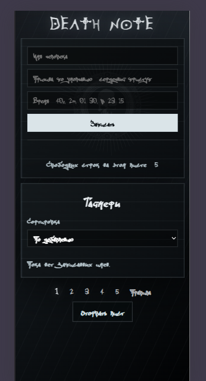
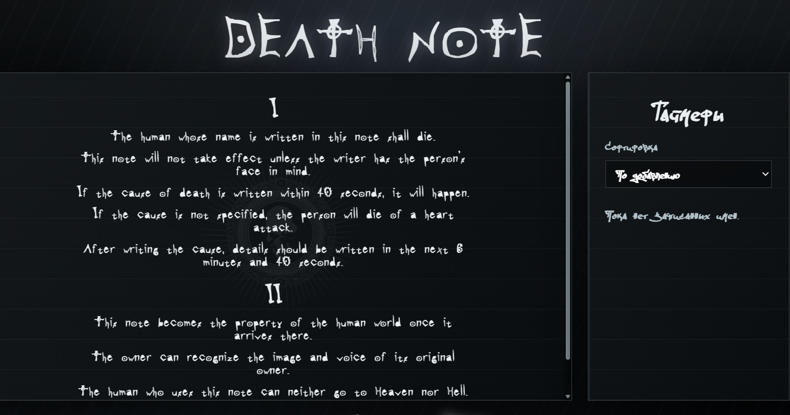
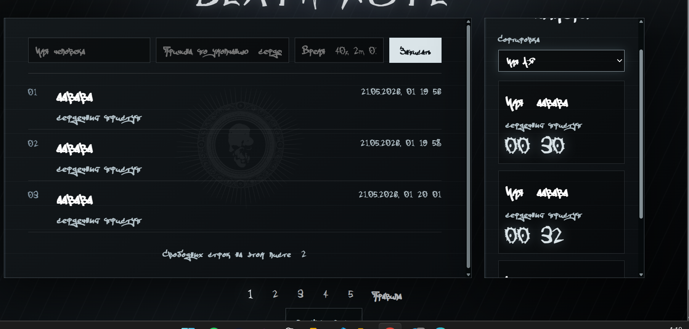
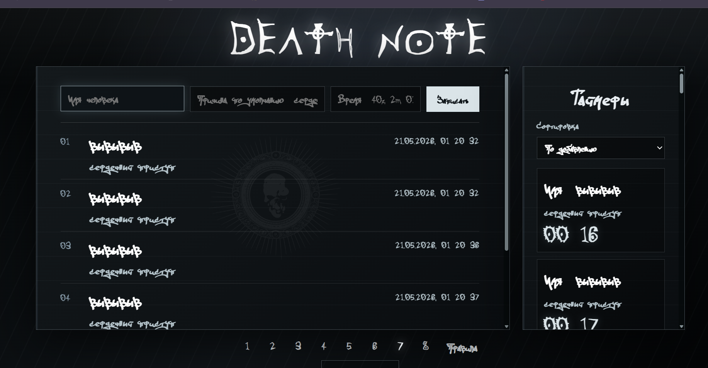

# Индивидуальна работа по Javascript
## Тема: Разработка интерактивного веб-приложения "Death Note"

## Цель работы: 
- Разработать развлекательное веб-приложение `"Death Note"` используя только `Vanilla JS`. 

## Требования 
1. Приложение должно уметь добавлять записи и удалять записи по таймеру, выводя сообщение об успехе. 

2. корректно обрабатывать введенные данные.

3. Иметь привлекательный и интуитивный адаптивный дизайн для лучшего `UI/UX` с современными анимациями и звуками как реакция на события.

4. Сортировать по выбранному параметру записи(значения и блоки таймеров).

5. Иметь четкую,понятную, распределённую архитектуру близкой к **MVT**.

# Запуск

Проект запускается как обычное Vanilla JS веб-приложение, но лучше через локальный сервер, потому что в `index.html` подключен модуль:

```html
<script type="module" src="scripts/index.js"></script>
```


1. Открыть папку `indJS` в VS Code.
2. Установить расширение **Live Server**, если его нет.
3. Нажать правой кнопкой по `index.html`.
4. Выбери **Open with Live Server**.


# Структура HTML


## Основные блоки

- `.book`
  - Внешняя обёртка всей книги/приложения.

- Заголовок `h1` — название приложения: `Death Note`.

- `.notebook`
  - Содержит основную часть страницы: лист и панель таймеров.

### Основная часть (`<main class="sheet">`)

- `<section id="write_view" class="write_view">`
  - Форма для введения данных:
    - `name_input` — имя человека.
    - `cause_input` — причина смерти.
    - `time_input` — время.
    - Кнопка `Записать`.
  - `<ol id="entries_list">` — список записей.
  - `<p id="page_hint">` — подсказка или сообщение страницы.

- `<section id="rules_view" class="rules hidden">`
  - Правила из вселенной Death Note.
  - Скрыт по умолчанию через класс `hidden`.

### Боковая панель (`<aside class="timers_panel">`)

- Заголовок `Таймеры`.
- Выпадающий список сортировки таймеров.
- `timers_list` — контейнер для списка таймеров.

### Пагинация и кнопка

- `<nav class="page_pagination">`
  - `#pagination` — навигация по страницам/листам.
  - Кнопка `Оторвать лист`.

## Модальные окна

- `<dialog id="death_modal">`
  - Показывает сообщение о смерти и кнопку закрытия.

- `<dialog id="error_modal">`
  - Показывает ошибки ввода.

## Скрипт

- `<script type="module" src="scripts/index.js">`
  - Подключает JavaScript, который управляет формой, таймерами, модалками и логикой страницы.

# Основные стили

- `@font-face`
  - Подключает кастомные шрифты `deathnnote` и `ofont` из папки fonts.
  - Переменные `--hand-font`, `--gothic-font`, `--death-font` используют эти шрифты, затем запасные `Georgia, serif`.

- `body`
  - Тёмный фон с градиентами.
  - Эффект свечения и текстура через `body::before`.

- `.book` / `.notebook`
  - Центрированная колонка.
  - Двухколоночная сетка: основная страница + панель таймеров.

## Важные визуальные элементы

- `.sheet`, `.timers_panel`, `.death_modal`
  - Полупрозрачные панели с рамкой и большим тенью.
  - Фон имитирует страницу блокнота.

- `.sheet::before`
  - Наложение с изображением skull.png и градацией `opacity: 0.055`.

- `.death_form`
  - Форма с четырьмя колонками.
  - Инпуты светятся при фокусе.

## Анимации и эффекты

- `@keyframes pageRip`
  - Анимация рвания страницы.
  - Использует `clip-path: polygon(...)` для имитации разрыва листа.

- `@keyframes sheetTurn`
  - Эффект переворота листа в 3D.

- `@keyframes inkWrite`
  - Эффект “записи чернилами” для новых записей.

- `@keyframes deathStamp`
  - Появление штампа `X` на завершённых записях.

## Список записей и таймеры

- `.entries_list` / `.entry`
  - Нумерация через CSS-счётчик `counter(death-entry)`.
  - Завершённые записи `.entry_done` перечёркиваются и получают `X`.

- `.timers_list` / `.timer_card`
  - Таймеры отображаются карточками.
  - Активные таймеры имеют пульсацию и эффект при наведении.

## Адаптивность

- `@media (max-width: 820px)`
  - Переключает `.notebook` на одну колонку.
  - Форма становится вертикальной.

- `@media (prefers-reduced-motion: reduce)`
  - Отключает анимации и плавные переходы для людей, которые этого предпочитают.  


# Что делает app.js

- app.js отвечает за логику взаимодействия пользователя с интерфейсом.
- Там подключаются данные из:
  - `constants.js` — настройки,
  - `audio.js` — звуки,
  - `dom.js` — ссылки на элементы страницы,
  - `render.js` — отрисовка страниц и таймеров,
  - `state.js` — модель записей и страниц,
  - `time.js` — парсинг времени и формат даты.

## Главные функции

- `addEntry`
  - Срабатывает при отправке формы.
  - Собирает имя, причину, время.
  - Проверяет ввод через `getValidationErrors`.
  - Создаёт запись и добавляет её на текущую страницу.
  - Обновляет страницу и таймеры.

- `getValidationErrors`
  - Проверяет имя, длину причины, корректность времени.
  - Возвращает список ошибок.

- `showErrorModal`
  - Показывает окно ошибок, если данные некорректны.

- `tearPage`
  - Анимирует разрыв страницы.
  - Удаляет текущую страницу и перерисовывает интерфейс.

- `changePage`
  - Меняет активную страницу.
  - Воспроизводит звук перелистывания и перерисовывает.

- `tickTimers`
  - Запускается через `setInterval`.
  - Проверяет все записи, у которых истёк срок.
  - Отмечает такие записи как умершие, ставит их в очередь смерти, обновляет таймеры и проигрывает звук.

- `showNextDeath`
  - Выводит следующее сообщение о смерти из очереди.
  - Показывает модальное окно.

- `hasActiveTimers`
  - Проверяет, есть ли ещё записи с незавершёнными сроками.

## Инициализация

- `initApp`
  - Навешивает события на форму, ввод, сортировку, кнопку “оторвать лист”, модалки.
  - Первоначально рендерит страницу и таймеры.
  - Запускает повторы таймеров через `TIMER_TICK_MS`.

## Идея

app.js — это связующее звено между состоянием (`state.js`), визуализацией (`render.js`), аудио (`audio.js`) и DOM. Он превращает поведение страницы в события: добавление записи, перелистывание, рождение смерти и обновление таймеров.


# Что делает audio.js

- audio.js управляет звуковыми эффектами приложения.

## Основные звуки

- `heartbeatSound` — зацикленный звук сердца.
- `clockSound` — зацикленный звук часов.
- `deathSound` — одиночный звук смерти.

## Ключевые функции

- `setupLoop(audio, volume)`
  - Включает `loop`, устанавливает громкость и предварительную загрузку.

- `playAudio(audio)`
  - Запускает аудио и подавляет возможную ошибку из `play()`.

- `stopAudio(audio)`
  - Останавливает и возвращает звук в начало.

- `syncTimerSounds(hasActiveTimers)`
  - Включает heartbeat + clock, когда есть активные таймеры.
  - Останавливает их, когда таймеров нет.

- `playDeathSound()`
  - Перезапускает и проигрывает эффект смерти.

## Генерация синтетических эффектов

- `getAudioContext()`
  - Создаёт или возобновляет `AudioContext`.

- `createNoiseBuffer(context, duration)`
  - Генерирует белый шум в аудиобуфере.

- `playFilteredNoise({ duration, startFrequency, endFrequency, volume })`
  - Создаёт источника шума, фильтр bandpass и плавно меняет частоту.
  - Используется для эффектов перелистывания и рвания.

## Эффекты страницы

- `playPageTurnSound()`
  - Генерирует короткий шум с частотой 2600 → 420 Гц.

- `playTearSound()`
  - Генерирует более длинный шум с частотой 3800 → 180 Гц.


# constants.js

- Содержит базовые настройки и значения по умолчанию.
- Основные константы:
  - `INITIAL_PAGE_COUNT = 5` — стартовое количество страниц.
  - `MAX_ENTRIES_PER_PAGE = 5` — максимум записей на одной странице.
  - `DEFAULT_CAUSE = "сердечный приступ"` — причина по умолчанию, если пользователь не указал.
  - `DEFAULT_CAUSE_DEATH_TEXT = "сердечного приступа"` — текст для сообщения о смерти.
  - `DEFAULT_DURATION_MS = 40 * 1000` — стандартная длительность таймера (40 секунд).
  - `TIMER_TICK_MS = 500` — частота обновления таймеров.
  - `HEARTBEAT_VOLUME`, `CLOCK_VOLUME`, `DEATH_VOLUME` — громкость звуков.

# dom.js

- Экспортирует объект `dom` с готовыми ссылками на элементы страницы.
- Включает:
  - форму и поля: `deathForm`, `nameInput`, `causeInput`, `timeInput`
  - контейнеры: `entriesList`, `pagination`, `timersList`
  - модалки: `deathModal`, `errorModal`, `deathMessage`, `errorList`
  - кнопки: `tearPageButton`, `closeModal`, `closeErrorModal`
  - блоки вида: `writeView`, `rulesView`, `sheet`

- Есть утилита `createElement(tag, className, text)`
  - Создаёт элемент, задаёт класс и текст, если нужно.


# index.js

- Самый простой файл.
- Импортирует `initApp` из app.js.
- Запускает приложение вызовом `initApp()`.

# render.js

- Отвечает за отрисовку интерфейса.
- Основные функции:
  - `renderPage(onChangePage, shouldAnimate)` — обновляет вид листа, правила, кнопку, пагинацию и анимацию.
  - `renderEntries()` — рендерит записи текущей страницы или скрывает список на странице правил.
  - `renderPagination(onChangePage)` — строит кнопки страниц, стрелки и «Правила».
  - `renderTimers()` — показывает карточки таймеров, сортирует их и обновляет время.
- Также:
  - `animateSheetTurn()` — добавляет эффект перелистывания.
  - `createTimerCard(entry)` — создает DOM-карту таймера.
  - `getSortedTimerEntries()` — сортирует записи по выбранному типу.

# state.js

- Хранит состояние приложения:
  - `pages`, `tornEntries`, `currentPage`, `entryId`, `deathQueue`, `lastEntryId`, `lastDeadId`.
- Функции управления:
  - `isRulesPage(index)` — проверяет, открыты ли правила.
  - `getAllEntries()` — возвращает все записи, включая удаленные листы.
  - `setCurrentPage(nextPage)` — переключает страницу с ограничением диапазона.
  - `ensureWritablePage()` — добавляет новую страницу, если последняя заполнена.
  - `moveToWritablePage()` — переходит на страницу, куда можно добавить новую запись.
  - `createEntry(name, cause, duration)` — создает объект записи.
  - `addEntryToCurrentPage(entry)` — добавляет запись на текущую страницу.
  - `tearCurrentPage()` — рвет страницу, переносит записи в `tornEntries`.
  - `markEntryDead(entry)` — помечает запись как завершенную.
  - `queueDeath(entry)` / `shiftDeathQueue()` — очередь смерти для модалки.

# time.js

- Работает с датами и временем.
- Основные функции:
  - `formatDate(date)` — форматирует дату/время в `ru-RU` с часами, минутами, секундами.
  - `formatEntryDate(timestamp)` — форматирует срок записи.
  - `formatRemaining(milliseconds)` — показывает оставшееся время в `MM:SS`.
  - `parseDuration(value)` — парсит пользовательский ввод:
    - пустая строка → 40 секунд,
    - `40s`, `2m`, `01:30`,
    - `в 23:15` или `at 23:15`,
    - `5h`, `15 мин` и т.д.


# Демонстрация работы












# Вывод

Проект — это интерактивный «Death Note» на JavaScript.

- `index.html`
  - Страница с формой записи имени, причиной и временем.
  - Есть раздел правил, панель таймеров, пагинация и модалки.

- `style.css`
  - Тёмный готический стиль с кастомными шрифтами.
  - Эффекты: фоновая текстура, перелистывание, рваная страница, анимация записи и таймеров.
  - Адаптивность для мобильных устройств.

- `app.js`
  - Основная логика: добавление записи, проверка ввода, рендер, таймеры, очереди смерти, кнопка рвания страницы.
  - Связывает состояние, рендеринг, DOM и аудио.

- `audio.js`
  - Звуки: heartbeat, clock, смерть.
  - Синтетические эффекты для переворота страницы и рвания.

- `constants.js`
  - Настройки: максимумы, таймеры, громкость, причина по умолчанию.

- `dom.js`
  - Сбор всех нужных DOM-элементов.
  - Утилита для создания элементов.

- `render.js`
  - Отрисовка страницы, записей, пагинации и таймеров.
  - Сортировка таймеров и визуальные эффекты.

- `state.js`
  - Хранение страниц, записей, порванных страниц, текущей страницы, очереди смерти.
  - Управление страницами и добавление/удаление записей.

- `time.js`
  - Парсинг времени из ввода.
  - Форматирование даты и оставшегося времени.

### Главное
Приложение создаёт запись, показывает её на странице, ведёт таймер и в нужный момент показывает модалку смерти.