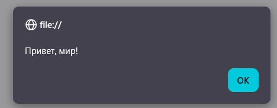
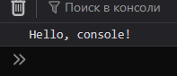
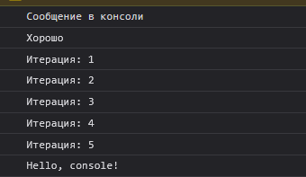

# **Лабораторная работа №1**
### Введение в `Javascript`

`console.log("Hello World!");`

    1.Откройте консоль разработчика (F12 → Console).
    2.Напишите команду `console.log("Hello, world!");` и нажмите Enter.
    3.Запишите в консоли 2 + 3 и посмотрите результат.


---
### Создайте файл index.html и вставьте в него следующий код.

```html
<!DOCTYPE html>
<html lang="en">
 <head>
   <title>Привет, мир!</title>
 </head>
 <body>
   <script src = "script.js">
    
   </script>
 </body>
</html>
```


***Результат:***

<p align="center">
  
  
</p>

если введем число 88 в prompt получим сообщение
~~можно лучше~~**"хорошо"**


---

Контрольные вопросы <!-- Ответы -->


- Чем отличается var от let и const?

      ключевое слово **var** создаёт переменную, видимую  и доступную внутри функции (функциональная область видимости), или во всей программе, если обЪявлена вне её, что может быть небезопаным, из-за чего это слово устарело.
      
      **let** - стандартное слово для инициализаии переменной, новые перемены доступны только внутри блока.
      
      **const** - создает константу, ее значение нельзя изменить по ходу выполнения программы. доступ к ней такой же как и в let. Для именования используются зачастую ЗАГЛАВНЫЕ БУКВЫ, а для обычых переменных - camelCase.

- Что такое неявное преобразование типов в JavaScript?

      JavaScript сам изменяет тип данных переменной, без участия программиста. Оно происходит при выполнении операций между значениями разных типов, например при сложении строки и числа, сравнении значений или логических операциях.

      Например, число может быть автоматически преобразовано в строку или true / false и наоборот,чтобы операция могла быть выполнена.
      
      javascript не выбросит ошибку в духе NumberFormatException как в Java, а сделает её типа NaN. 

- Как работает оператор == в сравнении с ===?

== --  сравнивает значения, если нужно, делает неявное преобразование типов.
Например:
```js
5 == "5" // true, строка превращается в число
0 == false // true, false превращается в 0
```

**=== --  оператор строгого сравнения.**
сравнивает точно тип и значение

<div style = "display:flex; justify-content:center;">

| Выражение            | Результат |
|----------------------|-----------|
| `5 == "5"`           | `true`    |
| `5 === "5"`          | `false`   |
| `0 == false`         | `true`    |
| `0 === false`        | `false`   |
| `null == undefined`  | `true`    |
| `null === undefined` | `false`   |
| "" == 0              | `true`    |
| "" === 0             | `false`   |
| " \t\n " == 0        | `true`    |
| " \t\n " === 0       | `false`   |

</div>

---

#### Источники:

презентация на курсе Moodle Javascript от Nickita Nartea
https://elearning.usm.md/pluginfile.php/702910/mod_resource/content/3/%28JavaScript_01%29_Introduction_To_JavaScript.pdf

данные для таблицы взяты с сайта:
https://developer.mozilla.org/ru/docs/Web/JavaScript/Reference/Operators/Strict_equality?

# Вывод

На этой лабораторной работе я научился работать javascript вводом/выводом, переменными, циклами и условиями как на сайте, так и локально на компьютере с помощью Node.js, а также обрел навыки для создания markdown документов и работой с git/gitHub.