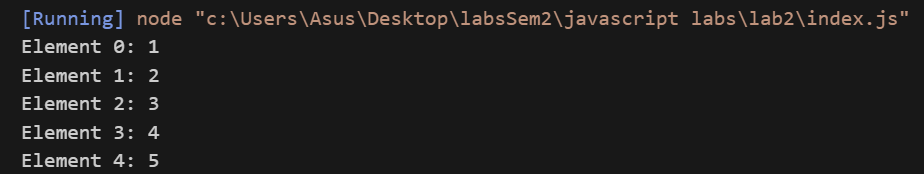
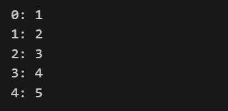
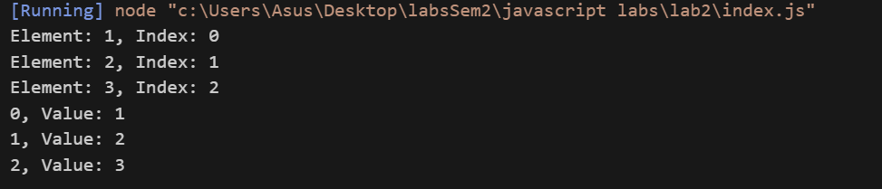
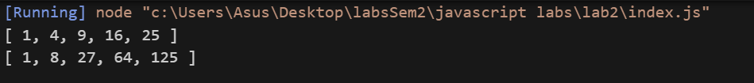
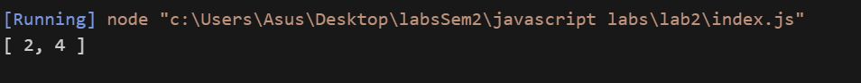
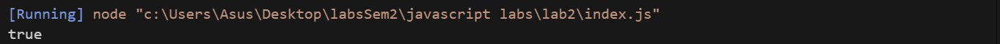
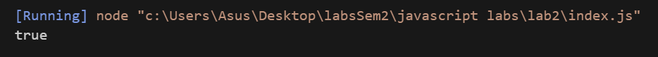
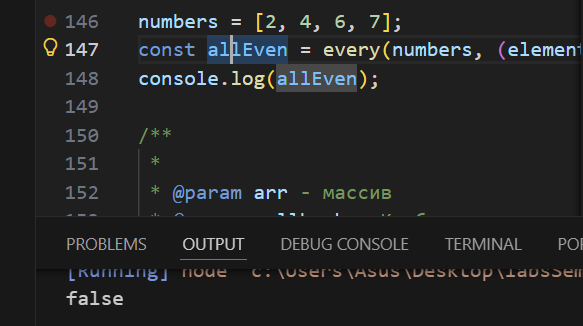
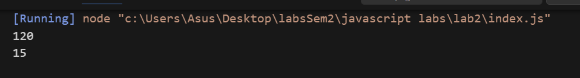

# Лабораторная работа №2
## Реализация базовых методов работы с массивами
### Цель работы
Целью данной работы является изучение принципов реализации базовых методов работы с массивами с использованием колбэков: forEach, map, filter, find, some, every, reduce, а также закрепление навыков написания функций с корректным возвратом результатов и обработкой граничных случаев

# Задание 1: PrintArray() и PrintArray1()

PrintArray - принимает как параметр массив.
Циклом for пробегаем по всем элементам (от нуля до arr.length) и выводим в консоль, конкатенация происходит через + `+`. По желанию можно написать.Ничего не возвращаем. 
```js
 `Element ${i}: ${arr[i]}}`
 ```
 
`console.log(printArray());` - выведет что это функция, не выведя значение, потому что значение - undefined

```js
const printArray = (arr) => {
    for (let i = 0; i < arr.length; i++) {
        console.log("Element " + i + ": " + arr[i]);
    }
}
```
### для массива [1,2,3,4,5]: 

**printArray**:



PrintArray1 - очень похож на предыдущую функцию, принцип такой же изменяется лишь формат вывода - меньше конкатенаций и короче вывод

```js
const printArray1 = (arr) => {
    for (let i = 0; i < arr.length; i++) {
        console.log(i + ": " + arr[i]);
    }
}
```

**printArray1**:


---

## Функция ForEach()
Я написал функцию, которая ничего не возвращает, принимает массив и **callback** функцию. Функция для каждого элемента массива применяет callback function.

```js
const forEach = (arr, callback) => {
    for (let i = 0; i < arr.length; i++)
        callback(arr[i], i, arr);
}
```

```js
// Пример использования длинного вывода
forEach(
        [1, 2, 3],
        (element, index, array) => {
            console.log(`Element: ${element}, Index: ${index}`);
            }
);
```


```js
//  Пример использования короткого вывода
forEach([1, 2, 3], (element, index, array) => {
    console.log(`${index}, Value: ${element}`);
});
```

Foreach вызывает определенную пользователем функцию, поэтому она универсальна, шаблон вывода определяет пользователь используя arrow expression, но можно конечно и другие способы создания функции применить по правилам синтаксиса.



## Функция Map
```js
const map = (arr, callback) => { // инициализируем функцию
    let newArr = [] // создаем новый массив, в котором будем хранить новые значения, и затем возвращать его
    for (let i = 0; i < arr.length; i++) { //arr.length раз делаем:
        newArr.push(callback(arr[i], i, arr)); // изменяем значение элемента с помощью callback и добавляем в конец массива. Callback нам вернет новое значение которое мы потом добавим в массив newArr.
    }
    return newArr; //возвращаем результат модифицированный массив
}
```

### Выводим данные
```js
console.log(map(([1, 2, 3, 4, 5]), (element, index, array) => element ** 2));
console.log(map(([1, 2, 3, 4, 5]), (element) => element ** 3)); //коллбэк функция возвращает новое значение, которое потом добавим в массив

```



## 3.Функция filter(array, callback)

```js
const filter = (arr, callback) => { // иницииализация функции
    let newArr = []; //Отфильтрованный массив
    for (let i = 0; i < arr.length; i++) {
        if (callback(arr[i], i, arr)) {// если коллбэк условие == true: 
            newArr.push(arr[i]);// добавляем в конец массива
        }
    }
    return newArr;//возвращаем отфильтрованный массивчик
}

```




### Выводим
```js
let numbers = [1, 2, 3, 4, 5];

const evenNumbers = filter(numbers, (element) => element % 2 === 0); //callback условие (четность числа) возвращает true или false (boolean)
console.log(evenNumbers);
```


## 4. Функция find(array, callback)
```js
const find = (arr, callback) => { //init
    for (let i = 0; i < arr.length; i++) { // Делаем n раз для каждого i < arr.length>:
        if (callback(arr[i], i, arr)) // если callback условие == true {
            return arr[i]; //возвращаем это число и прерываем функцию. Дальше нет смысла проверять. Если не найдено ничего не вернет(вернет undefined)
        }
    }

```

```js
let firstEven = find(numbers, (element) => element % 2 === 0);
console.log(firstEven); // 2

firstEven = find([], (element) => element % 2 === 0);
console.log(firstEven); // undefined
```


## 5. Функция some(array, callback)

```js
const some = (arr, callback) => {// init
    for (let i = 0; i < arr.length; i++) {//повторяем: 
        if (callback(arr[i], i, arr)) {
            return true //если для a[i] callback === true то завершаем, дальше проверять нет смысла.
        } 
    }
    return false; //если ни одно не прошло - возвращаем false
}
```


```js
numbers = [1, 2, 3, 4, 5];
const hasEven = some(numbers, (element) => element % 2 === 0);
console.log(hasEven); // true
```



### 6. Every
Принцип такой же как и в предыдущих функциях. меняется лишь возвращаемое значение и условие остановки на противоложное. Реверс делаем через ! (not)
```js
const every = (arr, callback) => {
    for (let i = 0; i < arr.length; i++) {
        if (!callback(arr[i], i, arr)) { // Если хотя бы раз не прошло, то уже не каждый, продолжать нет смысла.
            return false;
        }
    }
    return true;
}
```


```js
numbers = [2, 4, 6];
const allEven = every(numbers, (element) => element % 2 === 0);
console.log(allEven);
```




7. Функция reduce(array, callback, initialValue)

Принимает три аргумента:

array - массив
callback - функция обратного вызова. Колбэк принимает четыре аргумента:
initialValue - начальное значение аккумулятора

**начальное значение аккумулятора = НЗА** 

``` js
const reduce = (arr, callback, initialValue) => { // init

    if (arr.length === 0 && initialValue === undefined) {
        return undefined; // если массив пустой и НЗА == undefined - возвращаем undefined
    }

    //Если маасив пусстой и НЗА = 1 - вернет как результат 1.

    let accumulator; //переменная, хранящая хначение аккумуляторв
    let i = 0; //счетчик для цикла for

    if (initialValue === undefined) { // если НЗА не передано, то НЗА = первый элемент массива
        accumulator = arr[0];
        i = 1; // пропускаем первую итерацию, начинаем со второй
    } else
        accumulator = initialValue; // если передано, аккумулятору присваем значение параметра НЗА

 // Ключевая часть 
    for (i; i < arr.length; i++) {
        accumulator = callback(accumulator, arr[i], i, arr); //аккумулятор хранит в себе возвращаемое значение коллбэка. Коллбэк делает accumulator + element, это можно понять как:
        // accumulator += arr[i]
        //к новому прибавляем старый результат.
    }

    return accumulator;
};
```

```js
numbers = [1, 2, 3, 4, 5];
let sum = reduce(numbers, (accumulator, element) => accumulator * element, 1);
console.log(sum);
sum = reduce(numbers, (accumulator, element) => accumulator + element, 0);
console.log(sum);
```


# Контрольные вопросы и Контрольные ответы
1. **В чем преимущества использования колбэков при работе с массивами**

- Коллбэки сокращают количество кода, делают его современнее и читаемее, убирая шум. 
- Позволяют сделать функццию универсальной

- Коллбэк - это отдельная функция, которую отдельно легче читать, тестировать, дебажить.

- Функционаальный подход - пишем что делать, а не как делать

2. Какие проблемы могут возникать при использовании колбэков и как их избежать?

- Callback hell (ад колбэков)

    - Когда колбэки вложены друг в друга, код становится нечитаемым.

    - Чтобы избежать, можем : 
        - Использовать Promise

        - Использовать async / await

        - Выносить колбэки в отдельные функции    

- 2. Потеря контекста this

    - В колбэках this может указывать не туда, куда ты ожидаешь.
чтобы избежать , нужно прибегнуть к :

        - Стрелочные функции

        - bind, call, apply

Как реализовать функции map, filter, find, some, every и reduce без использования встроенных методов массивов?

Мы должны использовать Callback Функции как параметр в нашей реализации.


* **`map`** — пройтись по массиву циклом, применить функцию к каждому элементу и **записать результат в новый массив**.
* **`filter`** — пройтись по массиву, проверить условие и **добавлять только подходящие элементы** в новый массив.
* **`find`** — идти по массиву и **вернуть первый элемент**, для которого условие истинно; если нет — `undefined`.
* **`some`** — вернуть `true`, **если хотя бы один элемент** удовлетворяет условию.
* **`every`** — вернуть `true`, **если все элементы** удовлетворяют условию.
* **`reduce`** — инициализировать аккумулятор и **последовательно накапливать результат**, проходя по массиву.


