# Лабораторная работа №3
## Массивы, Функции и Объекты в javacscript

### Цель работы
Изучить основы работы с массивами и функциями в JavaScript, применяя их для обработки и анализа транзакций

## Задание 
Я должен создать консольное приложение для анализа транзакций.


## Шаг 1. Создание массива транзакций
Создаю файл main.js для размещения моего кода.


Создаю массив объектов с транзакциями. 

В файле data.js у меня 3 массива:
1. пустой
2. с одной транзакцией
3. с несколькими

Каждая транзакция должна содержать следующие свойства:
- transaction_id - уникальный идентификатор транзакции.
- transaction_date - дата транзакции.
- transaction_amount - сумма транзакции.
- transaction_type - тип транзакции (приход или расход).
- transaction_description - описание транзакции.
- merchant_name - название магазина или сервиса.
- card_type - тип карты (кредитная или дебетовая).

В моей программе он выглядит следующим образом:
```js
const emptyTransactions = [];

const oneTransaction = [
    {
        transaction_id: "1000",
        transaction_date: "2020-01-01",
        transaction_amount: 200.0,
        transaction_type: "debit",
        transaction_description: "Payment for electronics",
        merchant_name: "TechStore",
        card_type: "Visa",
        
    }
];


const transactions = [
    {
        transaction_id: "1",
        transaction_date: "2019-03-01",
        transaction_amount: 100.0,
        transaction_type: "debit",
        transaction_description: "Payment for groceries",
        merchant_name: "SuperMart",
        card_type: "Visa",
    },
    {
        transaction_id: "2",
        transaction_date: "2019-03-02",
        transaction_amount: 50.0,
        transaction_type: "credit",
        transaction_description: "Refund for returned item",
        merchant_name: "OnlineShop",
        card_type: "MasterCard",
    },
    {
        transaction_id: "3",
        transaction_date: "2022-03-03",
        transaction_amount: 75.0,
        transaction_type: "debit",
        transaction_description: "Dinner with friends",
        merchant_name: "RestaurantABC",
        card_type: "Amex",
    }
];
```


## Шаг 2. Реализация функций для анализа транзакций

Реализую следующие функции для анализа транзакций.

1. `getUniqueTransactionTypes(transactions)`

Возвращает массив уникальных типов транзакций.
```js
function getUniqueTransactionTypes(transactions) {
    const uniqueTypes = new Set();
    const result = [];

    for (let i = 0; i < transactions.length; i++) {
        if (!uniqueTypes.has(transactions[i].transaction_type)) {
            uniqueTypes.add(transactions[i].transaction_type);
            result.push(transactions[i]);
        }
    }

    return result;
}
```

создаем SET и добавляем в него тип из первой транзакции, если встречаем новый тип, которого нет в set (!has) то,добавляем его в конец множества через push.

можно использовать и алтернативный способ через **map и spread-оператор** (`...`):
```js
function getUniqueTransactionTypes(transactions) {
    return [...new Set(transactions.map(t => t.transaction_type))];
}
```

`map` -> возвращает новый массив из типов транзакций того же размера что и `transactions`. 
`new Set` -> убирает дубликаты
`...` - итерируемый обьект SET распаковываем в массив.

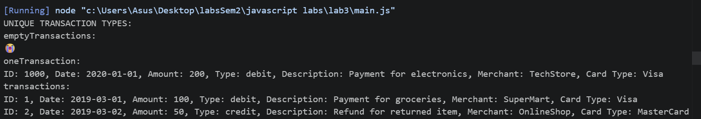


2. `calculateTotalAmount(transactions)` 

Вычисляет сумму всех транзакций.

```js
function calculateTotalAmount(transactions) {
    let s = 0;
    for (let i = 0; i < transactions.length; i++) {
        s += transactions[i].transaction_amount;
    }
    return s;
}
```

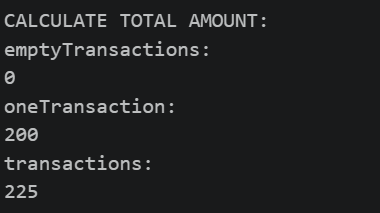

3. `calculateTotalAmountByDate(transactions, year, month, day)`

Вычисляет общую сумму транзакций за указанный год, месяц и день.

*Параметры year, month и day являются необязательными*

 *В случае отсутствия одного из параметров, метод производит **расчет по остальным.***

```js
function calculateTotalAmountByDate(transactions, year, month, day) {
    let total = 0;

    for (const t of transactions) {
        const [y, m, d] = t.transaction_date.split("-").map(Number);

        const match =
            (year === undefined || y === year) &&
            (month === undefined || m === month) &&
            (day === undefined || d === day);

        if (match) { 
            total += t.transaction_amount;
        }
    }

    return total;
}
```

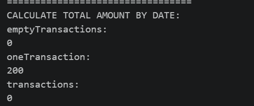

4. `getTransactionByType(transactions, type)` 
Возвращает транзакции указанного типа *(debit или credit)*.

```js
function getTransactionByType(transactions, type) {
    return transactions.filter(t => t.transaction_type === type);
}

```

ИЛИ

```js
function getTransactionByType(transactions, type) {
    let a = [];
    for (let i < 0; i < transactions.length; i++) {
        if (transactions[i].transaction_type==type)
            a.push(transactions[i])
 
    }   
    return a;
}
```
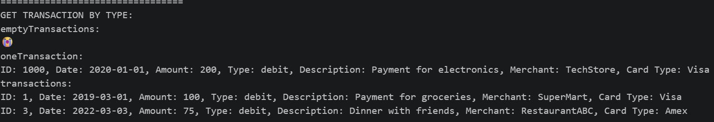

5. `getTransactionsInDateRange(transactions, startDate, endDate)` 

Возвращает массив транзакций, проведенных в указанном диапазоне дат от **startDate** до **endDate**.

```js
function getTransactionsInDateRange(transactions, startDate, endDate) {
    return transactions.filter(t => {
        const transactionDate = new Date(t.transaction_date);
        return transactionDate >= new Date(startDate) && transactionDate <= new Date(endDate);
    });
}
```

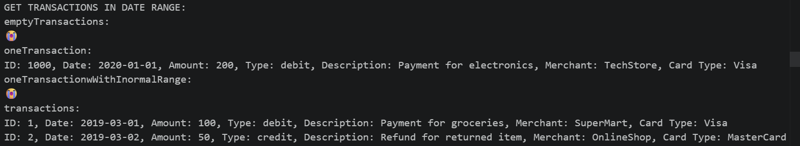

6. `getTransactionsByMerchant(transactions, merchantName)`

Возвращает массив транзакций, совершенных с указанным **merchantName**.


```js
function getTransactionsByMerchant(transactions, merchant) {
    return transactions.filter(t => t.merchant_name === merchant);
}

```

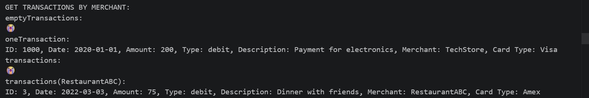

7. `calculateAverageTransactionAmount(transactions)`

 Возвращает среднее значение транзакций.

```js
let calculateAverageTransactionAmount = (transactions) => {
    if (transactions.length === 0) return 0; 
    return calculateTotalAmount(transactions) / transactions.length;
}
```
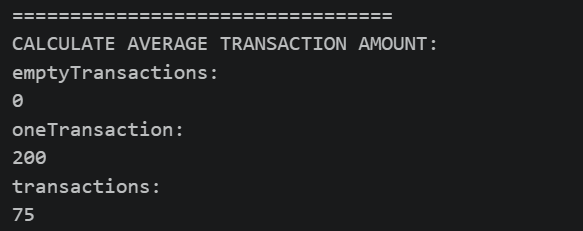

8. `getTransactionsByAmountRange(transactions, minAmount, maxAmount)`

 Возвращает массив транзакций с суммой в заданном диапазоне от **minAmount** до **maxAmount**.
```js
 function getTransactionsByAmountRange (transactions, minAmount, maxAmount) {
    return transactions.filter(t => t.transaction_amount >= minAmount && t.transaction_amount <= maxAmount);
}

```

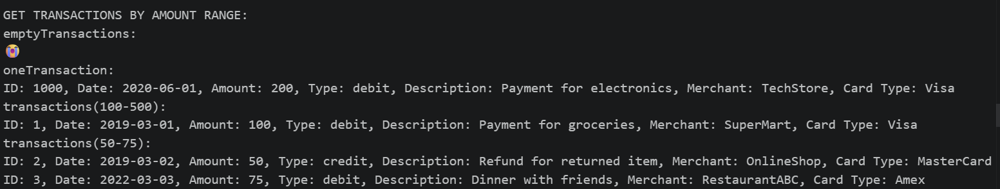
9. `calculateTotalDebitAmount(transactions)` 

Вычисляет общую сумму дебетовых транзакций.

```js
function calculateTotalDebitAmount(transactions) {
    let total = 0;
    for (const t of transactions) 
        if (t.transaction_type === "debit")
            total += t.transaction_amount;
        
    return total;
}
```

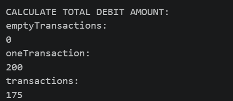

10. `findMostTransactionsMonth(transactions)` Возвращает месяц, в котором было больше всего транзакций.

```js
function findMostTransactionsMonth(transactions) {
    if (transactions.length === 0) {
        console.log("No transactions😭");
        return null;
    }

    const monthCounts = {};
    for (const t of transactions) {
        const month = t.transaction_date.split("-")[1] - 1;
        monthCounts[month] = (monthCounts[month] || 0) + 1;
    }

    let mostMonth = 0;
    let maxCount = 0;

    for (const month in monthCounts) {
        if (monthCounts[month] > maxCount) {
            maxCount = monthCounts[month];
            mostMonth = month;
        }
    }

    const monthNames = [
        "Jan", "Feb", "Mar", "Apr", "May", "Jun",
        "Jul", "Aug", "Sep", "Oct", "Nov", "Dec"
    ];
    return monthNames[Number(mostMonth)];
}
```

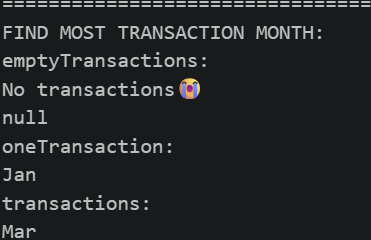

11. `findMostDebitTransactionMonth(transactions)` 

```js
function findMostDebitTransactionMonth(transactions) {

    if (transactions.length === 0) {
        console.log("No transactions😭")
        return null
        };

    const monthCounts = new Array(12).fill(0);
    for (const t of transactions) {
        if (t.transaction_type === "debit") {
            const month = t.transaction_date.split("-")[1]-1;
            monthCounts[month]++;
        }
    }

    let maxCount = monthCounts[0];
    let maxMonth = 1;
    for (let i = 1; i < monthCounts.length; i++) {
        if (monthCounts[i] > maxCount) {
            maxCount = monthCounts[i];
            maxMonth = i + 1;
        }
    }

    const monthNames = [
        "Jan", "Feb", "Mar", "Apr", "May", "Jun",
        "Jul", "Aug", "Sep", "Oct", "Nov", "Dec"
    ];

    return monthNames[maxMonth - 1];
}


```

Возвращает месяц, в котором было больше дебетовых транзакций.

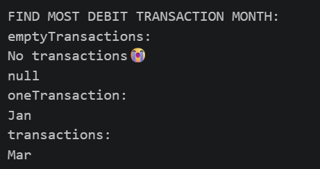

12. `mostTransactionTypes(transactions)`
Возвращает каких транзакций больше всего.

    - Возвращает debit, если дебетовых.
    - Возвращает credit, если кредитовых.
    - Возвращает equal, если количество равно.

```js
function mostTransactionTypes(transactions) {
    if (transactions.length === 0) {
        console.log("No transactions😭")
        return null
        };

    let debitCount = 0, creditCount = 0;
    for (let i = 0; i < transactions.length; i++) {
        if (transactions[i].transaction_type === "credit")
            creditCount++;
        else if (transactions[i].transaction_type === "debit")
            debitCount++;
    }
    if (debitCount > creditCount)
        return "debit";
    else if (creditCount > debitCount)
        return "credit";
    else
        return "credit = debit";
}
```


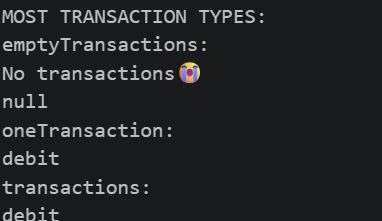


13. `getTransactionsBeforeDate(transactions, date)` – Возвращает массив транзакций, совершенных до указанной даты.

```js
function getTransactionsBeforeDate(transactions, date) {
    return transactions.filter(t => t.transaction_date < date);
}
```

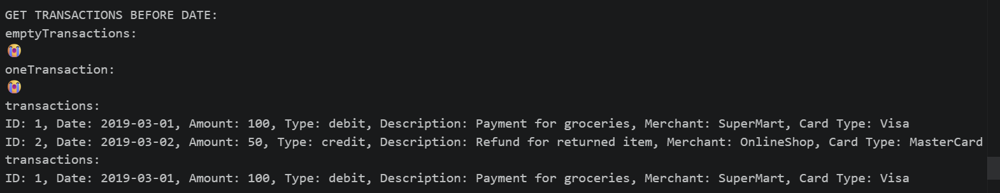
14. `findTransactionById(transactions, id)` – Возвращает транзакцию по ее уникальному идентификатору (id).

```js

function findTransactionById(transactions, id) {
    if (transactions === null || transactions.length === 0) {
        console.log("No transactions😭");
        return null;
    }
    const result = transactions.find(t => t.transaction_id === id);
    return result ? [result] : [];
}

```

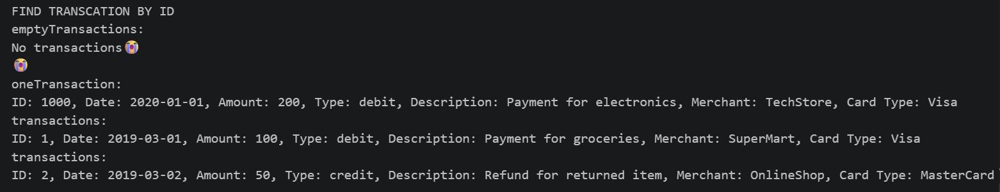
15. `mapTransactionDescriptions(transactions)` 

Возвращает новый массив, содержащий только описания транзакций.

```js
function mapTransactionDescriptions(transactions) {
    return transactions.map(t => t.transaction_description);
}

```

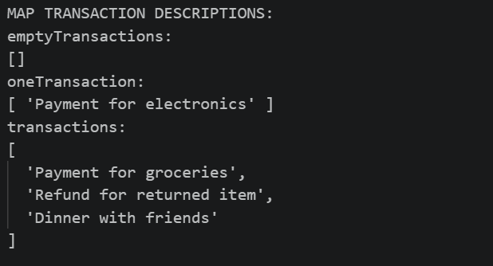

# Контрольные вопросы
1. Какие методы массивов можно использовать для обработки объектов в JavaScript?

Методы массивов для обработки объектов

`find()` — возвращает первый объект, удовлетворяющий условию
`filter()` — возвращает новый массив подходящих объектов
`map()` — преобразует каждый объект в новое значение
`reduce()` — сворачивает массив в одно значение (сумма, группировка и т.д.)
`forEach()` — перебирает объекты без возврата значения
`some() / every()` — проверяют условие для части или всех объектов
`sort()` — сортирует объекты по заданному критерию

2. Как сравнивать даты в строковом формате в JavaScript?

Если дата в формате `YYYY-MM-DD`, строки можно сравнивать **напрямую** через `<, >, === — `лексикографический порядок совпадает с хронологическим:
```js
"2024-03-15" > "2024-01-10" // true
"2024-03-15" === "2024-03-15" // true
```

Для более сложных случаев преобразуют в объект Date:
```js
new Date("2024-03-15") > new Date("2024-01-10") // true
```


3. В чем разница между map(), filter() и reduce() при работе с массивами объектов?

| Метод      | Что делает                         | Возвращает                               |
| ---------- | ---------------------------------- | ---------------------------------------- |
| `map()`    | Преобразует каждый элемент         | Новый массив той же длины                |
| `filter()` | Отбирает элементы по условию       | Новый массив (меньшей или равной длины)  |
| `reduce()` | Накапливает одно итоговое значение | Любой тип (число, объект, строка и т.д.) |
