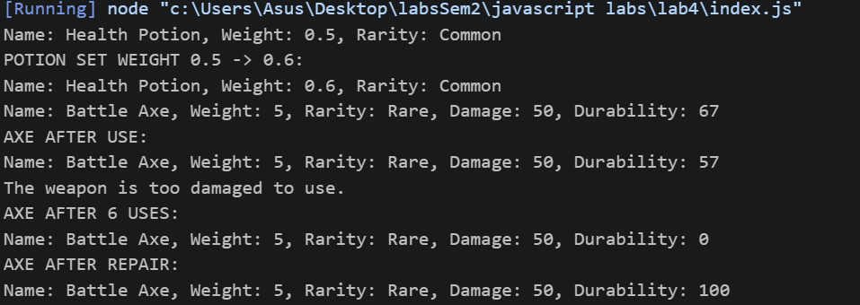

# Лабораторная работа №4. Продвинутые объекты в JavaScript

## Цель работы

Познакомиться с классами и объектами в JavaScript, научиться создавать классы, использовать конструкторы и методы, а также реализовать наследование.

## Условие

Создайте консольное приложение, моделирующее систему инвентаря, где можно добавлять предметы, изменять их свойства и управлять ими.

### Шаг 1. Создание класса `Item`

Создайте класс `Item`, который будет представлять предмет в инвентаре.

- **Поля класса**:
  - `name` – название предмета.
  - `weight` – вес предмета.
  - `rarity` – редкость предмета (`common`, `uncommon`, `rare`, `legendary`).
- **Методы**:
  - `getInfo()` – возвращает строку с информацией о предмете.
  - `setWeight(newWeight)` – изменяет вес предмета.

Пример использования:

```js
const sword = new Item("Steel Sword", 3.5, "rare");
console.log(sword.getInfo());
sword.setWeight(4.0);
```

```js
class Item {
    name;
    weight;
    rarity;
    /**
     * 
     * @param {String} name 
     * @param {Number} weight 
     * @param {String} rarity 
     */
 
    constructor(name, weight, rarity) {
        this.name = name;
        this.setWeight(weight);
        this.rarity = rarity;
    }
    /**
     * 
     * @returns {String}
     * 
     */
    getInfo() {
        return `Name: ${this.name}, Weight: ${this.weight}, Rarity: ${this.rarity}`;
    }

    setWeight(newWeight) {
        if (newWeight > 0) {
            this.weight = newWeight;
        }
    }
}
```

### Шаг 2. Создание класса `Weapon`

Создайте класс `Weapon`, который расширяет `Item`.

- **Дополнительные поля**:
  - `damage` – урон оружия.
  - `durability` – прочность (от 0 до 100).
- **Методы**:
  - `use()` – уменьшает `durability` на 10 (если `durability > 0`).
  - `repair()` – восстанавливает `durability` до 100.

**Пример использования**:

```js
const bow = new Weapon("Longbow", 2.0, "uncommon", 15, 100);
console.log(bow.getInfo());
bow.use();
console.log(bow.durability); // должно уменьшиться
bow.repair();
```

Для наследования можно использовать ключевое слово `extends` или следующую инструкцию:

```js
Weapon.prototype.__proto__ === Item.prototype // true
```


```js
function Weapon(name, weight, rarity, damage, durability) {
    Item.call(this, name, weight, rarity);
    this.damage = damage;
    this.durability = durability;
}

Weapon.prototype = Object.create(Item.prototype);
/**
 * @description use this for using the weapon, it will decrease durability by 10, if durability is less than or equal to 10, it will set durability to 0 and print a message
 */
Weapon.prototype.use = function() {

    if (this.durability <= 10) {
        this.durability = 0;
        console.log("The weapon is too damaged to use.");
    } else {
        this.durability -= 10;
    }

};

/**
 * @description use this for repairing the weapon, it will set durability to 100
 */
Weapon.prototype.repair = function() {
    this.durability = 100;
};

/**
 * @description use this for get Information about class properties, it will call the getInfo method of the Item class and add damage and durability information
 * @returns {String}
 */
Weapon.prototype.getInfo = function() {
    return `${Item.prototype.getInfo.call(this)}, Damage: ${this.damage}, Durability: ${this.durability}`;
};
```

### Шаг 3. Тестирование

1. Создайте несколько объектов классов `Item` и `Weapon`.
2. Вызовите их методы, чтобы убедиться в правильности работы.



### Шаг 4. Функция-конструктор и опциональная цепочка

1. **Опциональная цепочка** `(?.)` – используйте ее при доступе к свойствам объекта, чтобы избежать ошибок.
2. **Создание функции-конструктора**:
   - Перепишите классы `Item` и `Weapon`, используя **функции-конструкторы** вместо `class`.

```js
/**
 * 
 * @param {String} name 
 * @param {Number} weight 
 * @param {String} rarity 
 */
function Item(name, weight, rarity) {
    this.name = name;
    this.weight = 0;
    this.setWeight(weight);
    this.rarity = rarity;
}

/**
 * 
 * @returns {String} 
 * @description use this for get Information about class properties
 */
Item.prototype.getInfo = function() {
    return `Name: ${this.name}, Weight: ${this.weight}, Rarity: ${this.rarity}`;
};

/**
 * 
 * @param {Number} newWeight 
 * @description use this for setting the weight of the item
 */

Item.prototype.setWeight = function(newWeight) {
    if (newWeight > 0) this.weight = newWeight;
};

/**
 * 
 * @param {String} name 
 * @param {Number} weight 
 * @param {String} rarity 
 * @param {Number} damage 
 * @param {Number} durability 
 */
function Weapon(name, weight, rarity, damage, durability) {
    Item.call(this, name, weight, rarity);
    this.damage = damage;
    this.durability = durability;
}

Weapon.prototype = Object.create(Item.prototype);
/**
 * @description use this for using the weapon, it will decrease durability by 10, if durability is less than or equal to 10, it will set durability to 0 and print a message
 */
Weapon.prototype.use = function() {

    if (this.durability <= 10) {
        this.durability = 0;
        console.log("The weapon is too damaged to use.");
    } else {
        this.durability -= 10;
    }

};

/**
 * @description use this for repairing the weapon, it will set durability to 100
 */
Weapon.prototype.repair = function() {
    this.durability = 100;
};

/**
 * @description use this for get Information about class properties, it will call the getInfo method of the Item class and add damage and durability information
 * @returns {String}
 */
Weapon.prototype.getInfo = function() {
    return `${Item.prototype.getInfo.call(this)}, Damage: ${this.damage}, Durability: ${this.durability}`;
};


const potion = new Item();
potion.name = "Health Potion";
potion.weight = 0.5;
potion.rarity = "Common";

console.log(potion.getInfo());
potion.setWeight(0.6);
console.log("POTION SET WEIGHT 0.5 -> 0.6:");
console.log(potion.getInfo());

const axe = new Weapon("Battle Axe", 12, "Legendary", 50, 67);


console.log(axe.getInfo());

axe.use();
console.log("AXE AFTER USE:");
console.log(axe.getInfo());

for (let i = 0; i < 6; i++) axe.use();
console.log("AXE AFTER 6 USES:");
console.log(axe.getInfo());

axe.repair();
console.log("AXE AFTER REPAIR:");
console.log(axe.getInfo());
```


## Документирование кода

Код должен быть корректно задокументирован, используя стандарт `JSDoc`. Каждая функция и метод должны быть описаны с указанием их входных параметров, выходных данных и описанием функционала. Комментарии должны быть понятными, четкими и информативными, чтобы обеспечить понимание работы кода другим разработчикам.

## Контрольные вопросы

1. Какое значение имеет `this` в методах класса?

Значение this зависит от контекста вызова, а не от того, где метод определён. В обычном методе класса this указывает на экземпляр. Но если передать метод как колбэк, this теряется — это классическая ловушка.


2. Как работает модификатор доступа `#` в JavaScript?

делает поле приватным, оно доступно только внутри этого класса и к нему нельзя обратиться из другого места .

Модификатор # — настоящая приватность на уровне движка (не просто соглашение). Поле с # физически недоступно снаружи класса: ни через obj.field, ни через obj['field'], ни через прокси.

3. В чем разница между `классами` и `функциями-конструкторами`?

Классы — это синтаксический сахар над прототипным наследованием.


Функция-конструктор

```js
function Animal(name) {
  this.name = name;
}
Animal.prototype.speak = function() {
  return this.name;
};

// Можно вызвать без new:
Animal('кот'); // ошибка тихо
```

```js
Класс
class Animal {
  constructor(name) {
    this.name = name;
  }
  speak() {
    return this.name;
  }
}
// Без new — TypeError!

```
 под капотом классы используют тот же механизм прототипов — typeof Animal === 'function' вернёт true для класса. Разница — в удобстве, безопасности (нельзя забыть new, всегда strict mode) и дополнительных возможностях вроде #private полей и static.