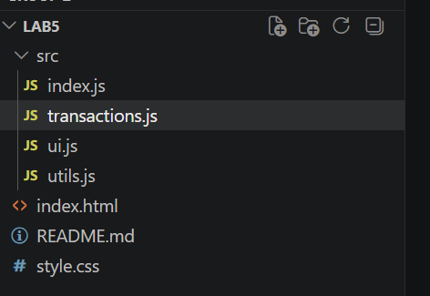
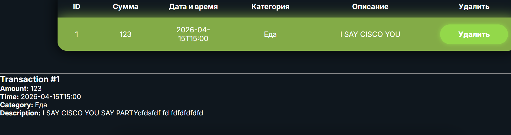
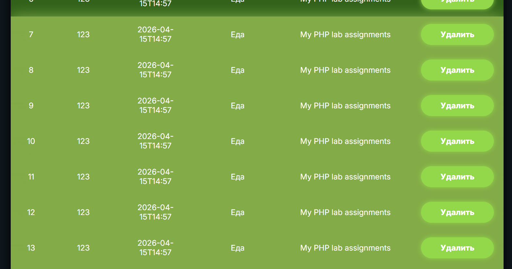
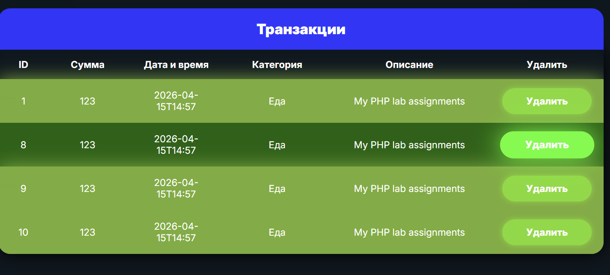
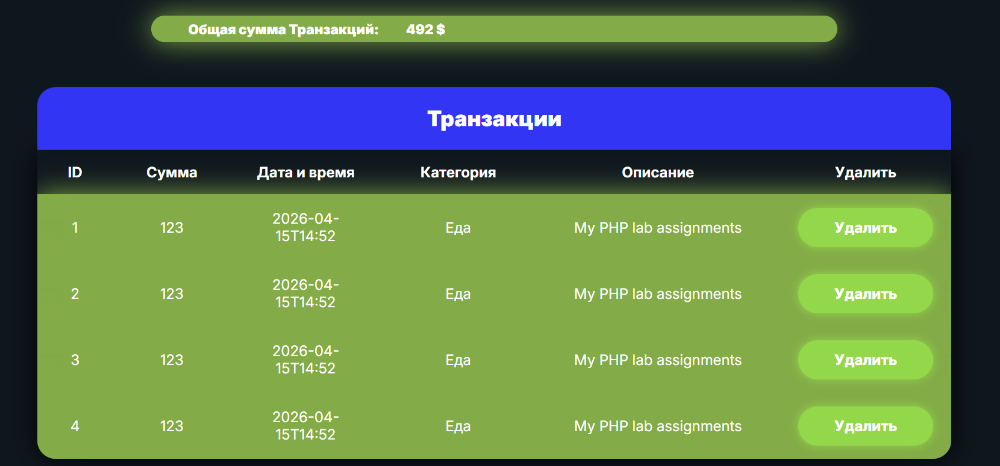
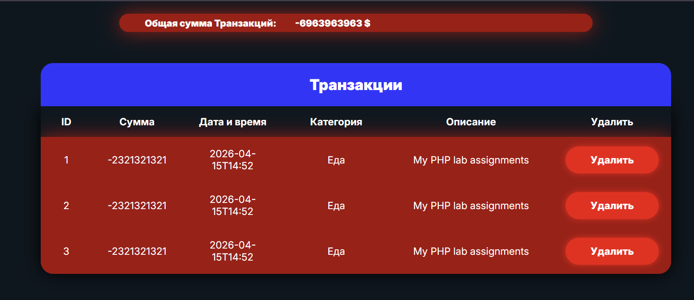
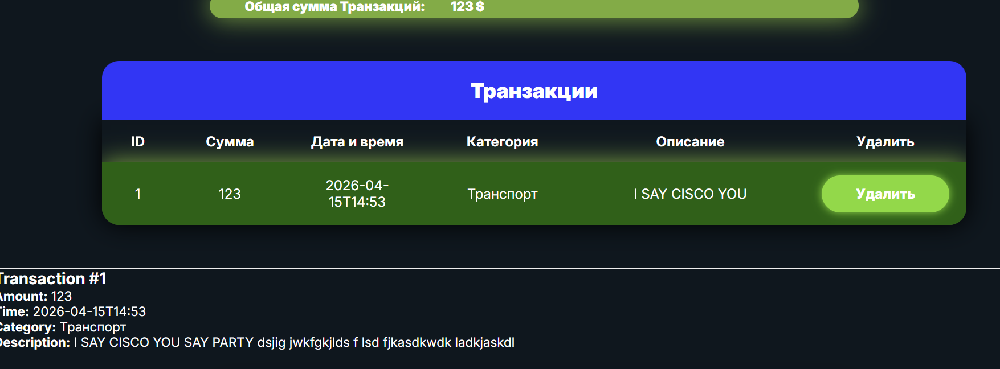
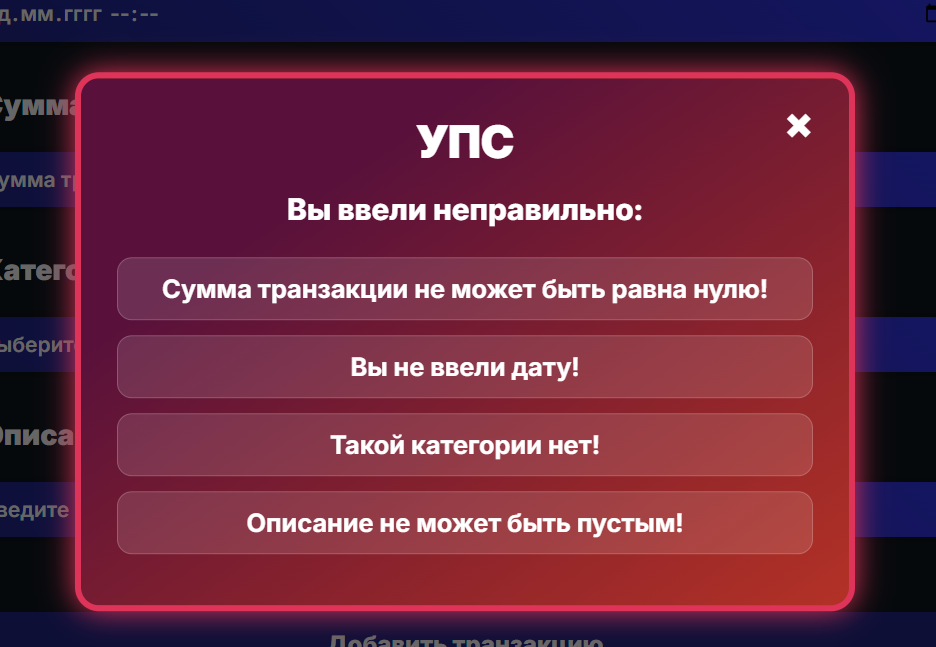

# Лабораторная работа №5. Работа с DOM-деревом и событиями в JavaScript

## Цель работы
Ознакомить студентов с основами взаимодействия JS с DOM-деревом на основе веб-приложения для учета личных финансов.

## Условия
### Шаг 1. Настройка и структурирование проекта
Создайте корневую папку проекта.
В корневой папке создайте директорию `/src`, где будет храниться весь код.

1. index.js – главный файл, который будет импортировать другие модули.

2. transactions.js – модуль для работы с массивом транзакций.

3. ui.js – модуль для работы с DOM (отрисовка таблицы, формы и т. д.).

4. utils.js – вспомогательные функции (например, генерация ID, форматирование даты).

Создайте `index.html` в корневой папке и подключите `index.js` с `type="module"`.
Создайте `style.css` и подключите его к **HTML**.



### Шаг 2. Представление транзакции

Создайте массив `transactions`, который будет содержать объекты транзакций.

Каждый объект транзакции должен иметь следующие поля:
- id: уникальный идентификатор транзакции.
- date: дата и время добавления транзакции.
- amount: сумма транзакции.
- category: категория транзакции.
- description: описание транзакции.

```js
export class Transaction {
    static #nextId = 1;
    errorFields = [];
    constructor(amount, date, category, description) {
        this.id = Transaction.#nextId++;
        this.valid = true;
        this.setAmount(amount);
        this.setDate(date);
        this.setCategory(category);
        this.setDescription(description);
    }
...
```

### Шаг 3. Отображение транзакций
Создайте пустую `HTML-таблицу`, куда в дальнейшем Вы будете добавлять транзакции.

Таблица должна содержать следующие столбцы:
- Дата и Время
- Категория транзакции
- Краткое описание транзакции
- Действие (кнопка удаления транзакции)


<table>
    <caption>Транзакции</caption>

    <thead>
        <tr>
            <th class="id">ID</th>
            <th>Сумма</th>
            <th>Дата и время</th>
            <th>Категория</th>
            <th class="description">Описание</th>
            <th>Удалить</th>
        </tr>
    </thead>

    <tbody></tbody>
</table> 

### Шаг 4. Добавление транзакций
Создайте функцию `addTransaction()`,
- В функции `addTransaction()`:
Создайте объект транзакции с данными из формы.

Добавьте созданный объект в массив `transactions`.

```js
export function addTransaction(renderTable) {
    const date = document.querySelector("#Date");
    const amount = document.querySelector("#Amount");
    const category = document.querySelector("#Category");
    const description = document.querySelector("#Description");

    console.log("date:", date?.value);
    console.log("amount:", amount?.value);
    console.log("category:", category?.textContent);
    console.log("description:", description?.value);

    let newTransaction;

try {
    newTransaction = new Transaction(
        amount.value,
        date.value,
        category.textContent.trim(),
        description.value
    );
    if (!newTransaction.valid) {
        throw new Error("Транзакция содержит ошибки!");
    }
} catch (error) {
    showModal(newTransaction.errorFields);
    console.error("Ошибка создания:", error.message);
    return;
}

    console.log("Pushing to transactions...");
    transactions.push(newTransaction.formObject());
    
    console.log("Calling renderTable...");
    renderTable(transactions);
}
```


```js
export function deleteTransaction(transactionId) {
    const index = transactions.findIndex(t => t.id === transactionId);
    if (index !== -1) {
        transactions.splice(index, 1);
    }

}
```

Создайте новую строку таблицы с данными из объекта транзакции и добавьте её в таблицу.

Если транзакция совершена на **положительную** сумму, то строка таблицы должна быть **зеленым** цветом, иначе **красным**.
В колонке `description` отображайте краткое описание транзакции **(первые 4 слова)**.



### Шаг 5. Управление транзакциями
В каждой строке таблицы добавьте `кнопку удаления`.

При клике на `кнопку удаления` получите `идентификатор` транзакции и удалите соответствующую строку таблицы и удалите данную транзакцию из массива.

Обработчик событий на клик на кнопку определите для элемента `<table>`

```js

const table = document.querySelector("table");
const details = document.getElementById("transactionDetails");

table.addEventListener("click", (e) => {
    const row = e.target.closest("tr");
    if (!row) return;

    const id = Number(row.dataset.id);
    const transaction = transactions.find(t => t.id === id);

    if (e.target.tagName === "BUTTON") {
        e.stopPropagation(); 

        row.classList.add("fade-out");

        setTimeout(() => {
            deleteTransaction(id);
            renderTable(transactions);
            details.innerHTML = "";
        }, 300);

        return;
    }

    if (transaction) {
        details.innerHTML = `
            <h3>Transaction #${transaction.id}</h3>
            <p><b>Amount:</b> ${transaction.amount}</p>
            <p><b>Time:</b> ${transaction.date}</p>
            <p><b>Category:</b> ${transaction.category}</p>
            <p><b>Description:</b> ${transaction.description}</p>
        `;
    }
});
```

 



### Шаг 6. Подсчет суммы транзакции

Напишите функцию `calculateTotal()`, которая будет вызываться после добавления или удаления транзакции.

```js

export function calculateTotal (transactions) {
    if (transactions.length === 0 || typeof transactions === "undefined") return 0;
    return transactions.reduce((acc, t) => acc + t.amount, 0);
}
```

Отобразите общую сумму на странице, например, в отдельном элементе.
```js
let shortDesc = transactions[i].description.split(' ').slice(0, 4).join(' ');
 <td>${shortDesc}</td>
```



### Шаг 7. Отображение полное транзакции
В файле `index.html` создайте блок для отображения подробного описания транзакции.

При нажатии на строку с транзакцией в таблице, отображайте полное описание в элементе `<div>` или `<p>` ниже таблицы.



### Шаг 8. Добавление транзакции
Добавьте форму на страницу для добавления транзакции в таблицу *(для категории используйте select).*
Валидируйте форму на наличие ошибок.
```js
export class Transaction {
  ...

    setAmount(amount) {
        try {
            const parsed = Number(amount);
            if (isNaN(parsed)) {
                throw new Error("Сумма должна быть числом, без букв!");
            }
            if (!Number.isInteger(parsed)) {
                throw new Error("Сумма должна быть целым числом!");
            }
            if (parsed === 0) {
                throw new Error("Сумма транзакции не может быть равна нулю!");
            }
            this.amount = parsed;
        } catch (error) {
            console.error("Amount Error:", error.message);
            this.errorFields.push(error.message);
            this.valid = false;
        }
    }

    setDate(date) {
        try {
            if (!date) {
                throw new Error("Вы не ввели дату!");
            }
            const currentDate = new Date();
            const inputDate = new Date(date);
            if (isNaN(inputDate.getTime())) {
                throw new Error("Некорректная дата!");
            }
            if (inputDate > currentDate) {
                throw new Error("Эта дата еще не наступила!");
            }
            this.date = date;
        } catch (error) {
            console.error("Date Error:", error.message);
            this.errorFields.push(error.message);
            this.valid = false;
        }
    }

    setCategory(category) {
        try {
            const categories = ["Еда", "Транспорт", "Развлечение", "Другое"];
            if (!categories.includes(category)) {
                throw new Error("Такой категории нет!");
            }
            this.category = category;
        } catch (error) {
            console.error("Category Error:", error.message);
            this.errorFields.push(error.message);
            this.valid = false;
        }
    }

    setDescription(description) {
        try {
            if (description.length === 0) {
                throw new Error("Описание не может быть пустым!");
            }
            if (description.length > 128) {
                throw new Error("Описание не может быть длиннее 128 символов!");
            }
            this.description = description;
        } catch (error) {
            console.error("Description Error:", error.message);
            this.errorFields.push(error.message);
            this.valid = false;
        }
    }

    formObject() {
        return {
            id: this.id,
            amount: this.amount,
            date: this.date,
            category: this.category,
            description: this.description
        };
    }
}
```


```html
 <div id="transactionDetails">
    
</div>
```

# Контрольные вопросы
1. Каким образом можно получить доступ к элементу на веб-странице с помощью JavaScript?

```js
document.getElementById('id')
document.getElementsByClassName('class')[0]
document.getElementByTagName('p')
document.querySelector('.class') 
document.querySelectorAll('div') 
```

2. Что такое делегирование событий и как оно используется для эффективного управления событиями на элементах DOM?

Всплытие и перехват(делегирование) событий позволяет реализовать один из самых важных приёмов разработки – делегирование.

Идея в том, что если у нас есть много элементов, события на которых нужно обрабатывать похожим образом, то вместо того, чтобы назначать обработчик каждому, мы ставим один обработчик на их общего предка.

Из него можно получить целевой элемент `event.target`, понять на каком именно потомке произошло событие и обработать его.

```js
document.querySelector('ul').addEventListener('click', (e) => {
  if (e.target.tagName === 'LI') {
    console.log(e.target.textContent);
  }
});
```

3. Как можно изменить содержимое элемента DOM с помощью JavaScript после его выборки?
Как можно добавить новый элемент в DOM дерево с помощью JavaScript?

**Изменение**

```js
const el = document.getElementById("text");
p.innerHTML = "Hello World!";
p.style.fontSize = 24;
p.style.margin = "20px";
```

**Добавление**

```js
const newEl = document.createElement('li');
newEl.textContent = 'Пункт';
document.querySelector('ul').appendChild(newEl);
```